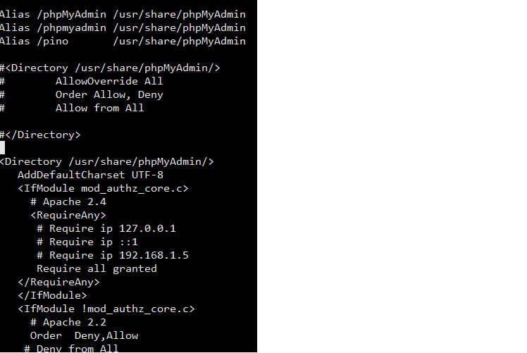

# Centos 7 - Lampp
Guida rapida all'installazione dei principali servizi per la messa in opera di un sistema di hosting di base:
- Http(+ php)
- MariaDB( + phpmyadmin)
- FTP

## Informazione sistema:


## Informazione rete:


## Installazione servizi ssh: 
I comandi per installare il servizio ssh su Centos7
```
  yum install sshd
  systemctl start sshd
  systemctl enable sshd
  
```

Status SSH


## Privileggi ssh:
Configurare con un editor(vim) sul file di configurazione per modificare i comportamenti di default, togliendo hashtag davanti
```
 Port //change port default
 
 PermitRootLogin no
 AllowUsers ebeta
```


## HTTP

installazione e avvio del servizio http

```
  yum install httpd
  systemctl start httpd
  systemctl enable httpd
```
Controllo lo stato del servizio


Servizio




Configurare il firewall per permettere l'accesso alla porta di default di HTTP(80/tcp) e caricamento delle impostazioni
```
  firewall-cmd --permanent --add-port=80/tcp
  firewall-cmd --reload
  
```

Testing il servizio via web


